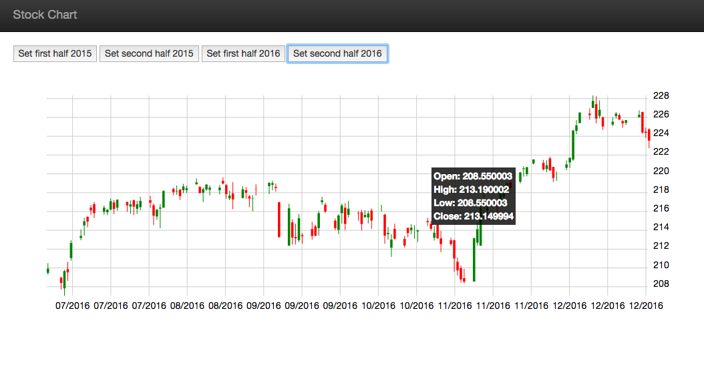

# Stocks chart using `angular-seed` 

This project is an application skeleton for a typical [AngularJS][angularjs] web app. 

The seed contains a sample AngularJS application and is preconfigured to install the Angular
framework and a bunch of development and testing tools for instant web development gratification.

### Geting Started
Clone the repository using git:

```
git clone https://github.com/wonsz1/stock-chart-angular-with-d3-example2.git
cd stock-chart-angular-with-d3-example2
```

### Install Dependencies

We have preconfigured `npm` to automatically run `bower` so we can simply do:

```
npm install
```

Behind the scenes this will also call `bower install`. After that, you should find out that you have
two new folders in your project.

* `node_modules` - contains the npm packages for the tools we need
* `app/bower_components` - contains the Angular framework files

### Run the Application

We have preconfigured the project with a simple development web server. The simplest way to start
this server is:

```
npm start
```

Now browse to the app at [`localhost:8000/app/index.html`][local-app-url].



